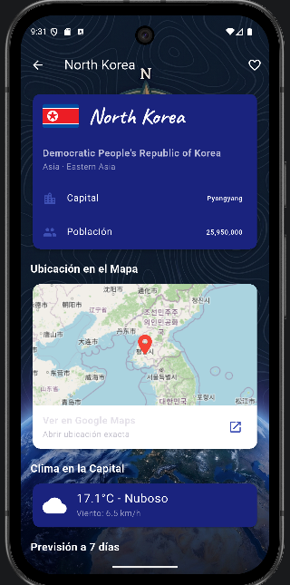

# WorldExplorer

Aplicacion movil desarrollada en Flutter que permite buscar cualquier pais del mundo y consultar su informacion cultural, geografica y meteorologica en tiempo real.

La app integra dos APIs REST publicas: REST Countries para los datos del pais (bandera, capital, poblacion, idiomas, monedas, fronteras) y Open-Meteo para el clima actual y la prevision de 7 dias de la capital. Incluye sistema de favoritos, historial de busquedas, mapa interactivo, modo oscuro y soporte para grados Celsius y Fahrenheit. Todo persiste entre sesiones.



## Instrucciones

```bash
flutter pub get
flutter run
```

## Video demostrativo

[Enlace al video]
