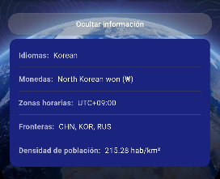

# WorldExplorer

Aplicacion movil desarrollada en Flutter que integra dos APIs REST publicas para ofrecer informacion completa sobre cualquier pais del mundo: datos geograficos y culturales en tiempo real combinados con la meteorologia actual de su capital.

---

## Que hace la app

Escribe el nombre de cualquier pais en ingles y la app consulta en tiempo real la informacion del pais y el clima de su capital. Las dos peticiones se encadenan automaticamente: primero se obtienen los datos del pais, y con las coordenadas de su capital se lanza la peticion meteorologica.

Funcionalidades principales:

- Busqueda de paises con historial de las ultimas 5 busquedas
- Ficha completa del pais: bandera, nombre oficial, capital, region, poblacion, idiomas, monedas, zonas horarias y paises fronterizos
- Clima actual de la capital: temperatura, viento y condicion meteorologica
- Prevision de 7 dias con iconos por tipo de tiempo
- Mapa interactivo con la ubicacion de la capital
- Sistema de favoritos persistente
- Modo oscuro y cambio de unidades entre Celsius y Fahrenheit
- Gestion de errores: sin conexion, pais no encontrado, timeout y respuesta malformada

---

## Capturas de pantalla

### Buscador

Pantalla principal con el campo de busqueda y los chips del historial de busquedas recientes. Cada chip relanza la busqueda directamente al pulsarlo.


---

### Detalle del pais

Vista principal del detalle tras buscar un pais. Muestra la bandera, el nombre oficial, la capital, la region, la poblacion formateada y el clima actual de la capital con temperatura, viento e icono de condicion meteorologica.


---

### Informacion adicional

Parte inferior de la pantalla de detalle. Incluye el mapa interactivo centrado en la capital, la prevision meteorologica de los proximos 7 dias en formato carrusel horizontal y la seccion de informacion ampliada con idiomas, monedas, zonas horarias, fronteras y densidad de poblacion.



---

## Extensiones implementadas

- E1: Sistema de favoritos persistente con shared_preferences. Se pueden anadir, eliminar y consultar desde una pantalla dedicada.
- E2: Prevision meteorologica de 7 dias con iconos mapeados a los weathercodes de Open-Meteo.
- E3: Vista detallada del pais: idiomas oficiales, monedas con simbolo, zonas horarias, paises fronterizos y densidad de poblacion calculada.
- E4: Historial de las ultimas 5 busquedas, persistente entre sesiones, con chips clicables y boton para borrar.
- E5: Toggle modo oscuro/claro y selector de unidades Celsius/Fahrenheit. Ambas preferencias persisten.
- E6: Gestion robusta de los 4 casos de error: sin conexion (SocketException), pais no encontrado (404), timeout y respuesta malformada (FormatException). Todos con mensaje claro y boton de reintentar.

---

## Fase 1: Investigacion de las APIs

**1. Endpoint de REST Countries para buscar por nombre y campos relevantes**

`GET https://restcountries.com/v3.1/name/{nombre}?fullText=false`

Campos utilizados: `name.common`, `name.official`, `flags.png`, `capital`, `region`, `subregion`, `population`, `capitalInfo.latlng`, `languages`, `currencies`, `timezones`, `borders`, `area`.

**2. Como se obtienen las coordenadas de un pais**

Del campo `capitalInfo.latlng`, que contiene latitud y longitud de la capital. Si no existe (territorios sin capital reconocida), se usa como fallback el campo general `latlng` del pais.

**3. Endpoint de Open-Meteo y parametros**

`GET https://api.open-meteo.com/v1/forecast`

Parametros enviados: `latitude`, `longitude`, `current_weather=true`, `daily=temperature_2m_max,temperature_2m_min,weathercode`, `timezone=auto`.

**4. Estructura del JSON de Open-Meteo**

- `current_weather`: objeto con `temperature`, `windspeed`, `weathercode`, `is_day` y `time`.
- `daily`: objeto con arrays indexados por dia con `time`, `temperature_2m_max`, `temperature_2m_min` y `weathercode`.

---

## Dependencias

| Paquete | Version | Uso |
|---------|---------|-----|
| http | ^1.6.0 | Peticiones GET a las dos APIs REST. |
| shared_preferences | ^2.5.5 | Persistencia de favoritos, historial y preferencias entre sesiones. |
| intl | ^0.20.2 | Formateo de la poblacion con separadores de miles. |
| provider | ^6.1.5+1 | Gestion del estado global de la app: tema, favoritos, historial y unidades. |
| flutter_map | ^8.3.0 | Mapa interactivo con OpenStreetMap en la pantalla de detalle. |
| latlong2 | ^0.9.1 | Tipos de coordenadas geograficas requeridos por flutter_map. |
| url_launcher | ^6.3.2 | Apertura de Google Maps desde el minimapa. |
| google_fonts | ^8.1.0 | Tipografia Caveat para el nombre del pais en la pantalla de detalle. |

---

## Instrucciones de ejecucion

```bash
flutter pub get
flutter run
```

---

## Video demostrativo

[Enlace al video]

---

## Uso de inteligencia artificial

Se han utilizado herramientas de IA como ayuda en el desarrollo. Todo el codigo entregado ha sido revisado y comprendido en su totalidad.
